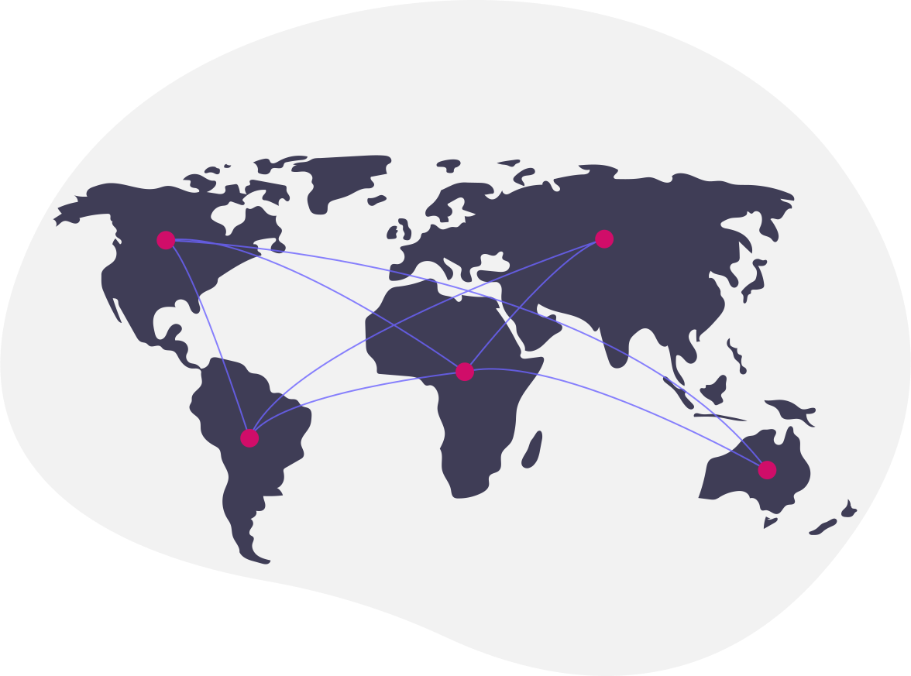

# Introduction to Information Theory

###### Information Theory is a branch of mathematics that has many applications in the field of computer science. Such as in cryptography, machine learning and project management.

---

# What is Information Theory?

Information theory is the study of how information can be efficiently stored, transmitted, processed.

## What is Information?

Information is what allows one mind to influence another. It is the data that is transmitted from one mind to another during a communication process.

---

# How to measure Information?

- Bits: measure of surprise, the more surprising an event is, the more information it contains.

## Information measure formula

$$I(x) = -log_2(p(x))$$

---

# WTF is this formula? Let's dissect it.
- $I(x)$ is the information contained in the event $x$.
- $p(x)$ is the probability of the event $x$.
- $log_2$ is the logarithm base 2.

To discover the information (I) contained in the event $x$, we need to know the probability of the event $x$ and apply it to the $log_2$ function.

---

# Example

Let's assume the probability to snow in 3 different brazilian cities: :snowflake: :snowflake: :brazil:

 

| City | Probability | Information |
|:----:|:-----------:|:-----------:|
|  São Paulo | 1% | $I(SP) = -log_2(0.01) = 6.6439$ bits. |
|  Rio de Janeiro | 0.001% | $I(RJ) = -log_2(0.0001) = 13.2877$ bits. |
| São Joaquim | 80% | $I(SJ) = -log_2(0.8) = 0.3219$ bits. |

---

- Notice that the more surprising an event is, the more information it contains. 

- No one would be surprised if it snowed in São Joaquim, but if it snowed in São Paulo or Rio de Janeiro, it would be a big surprise, would be an event with a lot of information.

---

# Entropy

- Amount of disorder in a system.

- As things grow, the entropy grows together.

- More information available = more disorder.

---

# Entropy and chaos

- Entropy is a measure of chaos. The more entropy, the more chaotic the system.

## Stephen Hawking

> "The increase of disorder or entropy is what distinguishes the past from the future, giving a direction to time."

---

# You can't run away from entropy, deal with it

- Entropy is a natural law of the universe. It is a measure of disorder.

- Do your fast-growing company is more chaotic now than it was when you started? Yes, it is.
- Why? Because it is growing.
- What is the solution? Try to keep the chaos under control as eliminating it is impossible.

---

# Entropy and Information

- Entropy is an important concept in information theory. Probably the most important concept.

## Entropy formula

$$H(X) = -\sum_{i=1}^{n}p(x_i)log_2(p(x_i))$$

---

# WTF is this formula² ? Let's dissect it.

- $H(X)$ is the entropy of the random variable $X$.
- $p(x_i)$ is the probability of the event $x_i$.
- $log_2$ is the logarithm base 2.

To discover the entropy (H) of the random variable $X$, we need to know the probability of each event $x_i$ and apply it to the formula.

---

# Example

You are a data scientist building a decision tree to predict which ad you should show to an user based on its profile. You have 3 possible ads to show to the user:

 

| Ad | Probability |
|:----:|:-----------:|
|  Ad 1 | 0.6 |
|  Ad 2 | 0.3 |
| Ad 3 | 0.1 |

---

You want to reduce the entropy of the system, so you need to know how much entropy you have now.

 

$$H(X) = -0.6log_2(0.6) - 0.3log_2(0.3) - 0.1log_2(0.1)$$
$$H(X) = 0.5219 + 0.1542 + 0.4685$$
$$H(X) = 1.1446$$

---

## How to interpret this result?

- The entropy of the system is 1.1446 bits.

### How to reduce the entropy?

- You can reduce the entropy by showing the ad with the highest probability.

## But why is it bad to show the ad with the lowest probability?

- Because it is the least surprising ad. Probably the user has already seen it many times.

---

# Information Theory Applications

- Cryptography
- Machine Learning
- Project Management
- Data Compression

---

# Cryptography

---

## Cryptography and Information Theory

- Encryption is the process of encoding information.
- Decryption is the process of decoding information.
- The more information you have, the more difficult it is to decode the information.
- Good encryption algorithms should have a high entropy.
- UUIDs usually have around 122 bits of entropy.

---

# Machine Learning

---

## Machine Learning and Information Theory

- Information gain.
- Information bottleneck.
- Mutual information.

---

# Project Management

---

## Project Management and Information Theory

- Risk management.
- Minimum Description Length.

---

# Data Compression

---

## Data Compression and Information Theory

-
---

# Thank you!

Thank you for your attention. I hope you enjoyed this talk. If you have any questions, please feel free to contact me.

  <a href="https://www.linkedin.com/in/jose-thomaz/" target="_blank" style="margin-right: 20px;"><i class="fa fa-linkedin fa-3x" aria-hidden="true"></i>@jose-thomaz</a>

  <a href="https://www.twitter.com/josethz00" target="_blank" style="margin-right: 20px;"><i class="fa fa-twitter fa-3x" aria-hidden="true"></i>@josethz00</a>

  <a href="https://github.com/josethz00" target="_blank" style="margin-right: 20px;"><i class="fa fa-github fa-3x" aria-hidden="true"></i>@josethz00</a>